# 📖 ITMS — Hướng dẫn Sử dụng Hệ thống

> **IT Management System** — Hệ thống Quản lý Công nghệ Thông tin  
> Phiên bản: 1.0 | Cập nhật: 14/03/2026

---

## Mục lục

1. [Giới thiệu Hệ thống](#1-giới-thiệu-hệ-thống)
2. [Đăng nhập & Xác thực](#2-đăng-nhập--xác-thực)
3. [Dashboard — Tổng quan](#3-dashboard--tổng-quan)
4. [Quản lý Kế hoạch Ngân sách](#4-quản-lý-kế-hoạch-ngân-sách)
5. [Quản lý Chi phí Thực tế](#5-quản-lý-chi-phí-thực-tế)
6. [Dự báo Chi phí](#6-dự-báo-chi-phí)
7. [Quản lý Dự án](#7-quản-lý-dự-án)
8. [Quản lý NCC & Hợp đồng](#8-quản-lý-ncc--hợp-đồng)
9. [Quản lý Tài sản Phần mềm](#9-quản-lý-tài-sản-phần-mềm)
10. [Quản lý Tài sản Phần cứng & Hạ tầng](#10-quản-lý-tài-sản-phần-cứng--hạ-tầng)
11. [Quản lý Phương tiện](#11-quản-lý-phương-tiện)
12. [Báo cáo Tổng hợp](#12-báo-cáo-tổng-hợp)
13. [Nhật ký Hoạt động](#13-nhật-ký-hoạt-động)
14. [Quản trị Hệ thống](#14-quản-trị-hệ-thống)
15. [Flows & Use Cases](#15-flows--use-cases)

---

## 1. Giới thiệu Hệ thống

ITMS là hệ thống quản lý tổng hợp dành cho bộ phận CNTT, cho phép:
- **Lập kế hoạch ngân sách** hàng năm/quý
- **Theo dõi chi phí thực tế** so với ngân sách
- **Quản lý tài sản IT** (phần cứng, phần mềm, hạ tầng)
- **Quản lý nhà cung cấp** và hợp đồng
- **Dự báo chi phí** cho các kỳ tới
- **Quản lý dự án IT** và ngân sách dự án
- **Báo cáo tổng hợp** và nhật ký hoạt động

### Các vai trò người dùng

| Vai trò | Quyền hạn |
|---------|-----------|
| **Admin** | Toàn quyền: CRUD tất cả module, quản lý user, phê duyệt kế hoạch |
| **Manager** | Xem tất cả, tạo/sửa kế hoạch, phê duyệt, quản lý dự án |
| **User** | Xem dữ liệu, tạo chi phí, cập nhật tài sản được giao |
| **Viewer** | Chỉ xem, không có quyền tạo/sửa/xóa |

---

## 2. Đăng nhập & Xác thực

### Đường dẫn: `/login`

### Các bước thao tác

1. Truy cập địa chỉ hệ thống (ví dụ: `https://itms.haivan.com`)
2. Nhập **Email** vào ô "Email đăng nhập"
3. Nhập **Mật khẩu** vào ô "Mật khẩu"
4. Nhấn nút **"Đăng nhập"**
5. Hệ thống chuyển đến Dashboard nếu thông tin đúng

### Lưu ý bảo mật

| Quy tắc | Chi tiết |
|---------|----------|
| **Rate Limiting** | Tối đa **5 lần thử** trong 1 phút. Lần 6 sẽ bị chặn (HTTP 429) |
| **Session** | Access Token hết hạn sau 1h, tự động refresh |
| **Đăng xuất** | Nhấn avatar góc phải → "Đăng xuất" |

### Xử lý sự cố

| Vấn đề | Cách xử lý |
|--------|-----------|
| Quên mật khẩu | Liên hệ Admin để reset |
| Bị khóa tạm | Đợi 1 phút rồi thử lại |
| Trắng trang | Kiểm tra kết nối mạng, xóa cache trình duyệt |

---

## 3. Dashboard — Tổng quan

### Đường dẫn: `/` (Trang chủ)

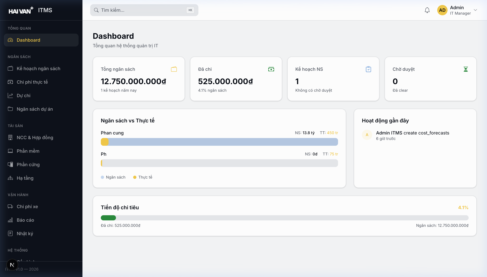

### Các thành phần trên màn hình

| # | Thành phần | Mô tả |
|---|-----------|-------|
| 1 | **Sidebar** (thanh bên trái) | Menu điều hướng chính, có thể thu gọn |
| 2 | **Thẻ Tổng ngân sách** | Tổng ngân sách các kế hoạch đã duyệt trong năm |
| 3 | **Thẻ Đã chi** | Tổng chi phí thực tế ghi nhận |
| 4 | **Thẻ Kế hoạch** | Số kế hoạch ngân sách đang hoạt động |
| 5 | **Biểu đồ Budget vs Actual** | So sánh ngân sách và thực chi theo tháng (bar chart) |
| 6 | **Thanh tiến trình chi tiêu** | Phần trăm ngân sách đã sử dụng |
| 7 | **Hoạt động gần đây** | Danh sách 5 thao tác mới nhất trên hệ thống |

### Thao tác

- **Xem chi tiết biểu đồ**: Hover lên biểu đồ để xem số liệu cụ thể
- **Chuyển trang**: Nhấn các mục trên Sidebar để điều hướng
- **Thu gọn Sidebar**: Nhấn icon hamburger (☰) trên thanh header

---

## 4. Quản lý Kế hoạch Ngân sách

### Đường dẫn: `/budget/plans`

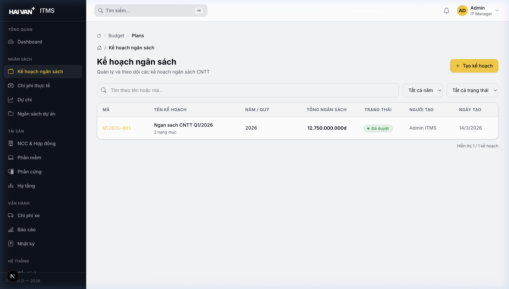

### 4.1 Danh sách Kế hoạch

| # | Thành phần | Mô tả |
|---|-----------|-------|
| 1 | **Bộ lọc Năm** | Dropdown chọn năm (2024, 2025, 2026...) |
| 2 | **Bộ lọc Trạng thái** | Lọc theo: Tất cả, Nháp, Chờ duyệt, Đã duyệt, Từ chối |
| 3 | **Nút "Tạo kế hoạch"** | Mở form tạo kế hoạch mới |
| 4 | **Bảng danh sách** | Mã KH, Tên, Năm/Quý, Tổng ngân sách, Trạng thái, Hành động |
| 5 | **Phân trang** | Điều hướng giữa các trang dữ liệu |

### 4.2 Tạo Kế hoạch Mới

**Đường dẫn**: `/budget/plans/create`

**Các bước**:
1. Nhấn **"Tạo kế hoạch"** từ trang danh sách
2. Nhập thông tin cơ bản:
   - **Tên kế hoạch**: VD "Ngân sách CNTT Q1/2026"
   - **Năm**: 2026
   - **Quý** (tùy chọn): Q1, Q2, Q3, Q4
   - **Mô tả**: Ghi chú về kế hoạch
3. Thêm **Hạng mục chi phí** (Category):
   - Nhấn **"+ Thêm hạng mục"**
   - Nhập: Tên hạng mục (VD "Phần cứng"), Mô tả
4. Thêm **Danh mục con** (Budget Item) trong mỗi hạng mục:
   - Nhấn **"+ Thêm danh mục"** trong hạng mục tương ứng
   - Nhập: Tên, Đơn giá, Số lượng, Đơn vị
   - Hệ thống tự tính **Thành tiền = Đơn giá × Số lượng**
5. Nhấn **"Lưu nháp"** hoặc **"Gửi duyệt"**

### 4.3 Xem Chi tiết & Phê duyệt

**Đường dẫn**: `/budget/plans/[id]`

**Thao tác**:
- **Xem**: Nhấn vào tên kế hoạch trong danh sách
- **Sửa**: Nhấn icon bút chì (chỉ khi trạng thái "Nháp")
- **Phê duyệt**: Nhấn nút "Phê duyệt" (chỉ Admin/Manager)
- **Từ chối**: Nhấn nút "Từ chối" + nhập lý do

### 4.4 Trạng thái Kế hoạch

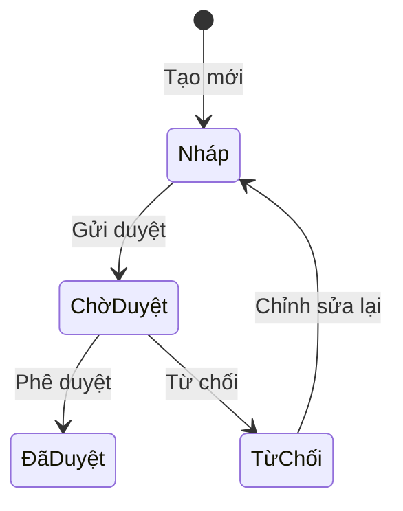

---

## 5. Quản lý Chi phí Thực tế

### Đường dẫn: `/costs`

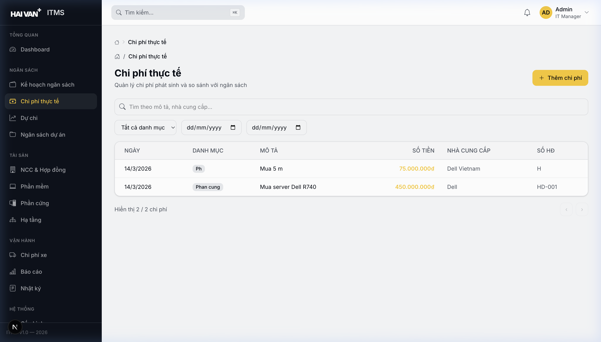

### 5.1 Danh sách Chi phí

| # | Thành phần | Mô tả |
|---|-----------|-------|
| 1 | **Ô tìm kiếm** | Tìm theo mô tả, nhà cung cấp |
| 2 | **Bộ lọc Danh mục** | Hardware, Software, Services, Network... |
| 3 | **Bộ lọc Khoảng ngày** | Chọn từ ngày — đến ngày |
| 4 | **Nút "Thêm chi phí"** | Mở form ghi nhận chi phí mới |
| 5 | **Bảng chi phí** | Ngày, Danh mục, Mô tả, Số tiền, Nhà cung cấp, Dự án |

### 5.2 Ghi nhận Chi phí Mới

**Đường dẫn**: `/costs/create`

**Các bước**:
1. Nhấn **"Thêm chi phí"** từ trang danh sách
2. Chọn **Danh mục ngân sách** (Budget Item) liên kết
3. Chọn **Dự án** (nếu có)
4. Nhập **Ngày phát sinh**
5. Nhập **Tên danh mục chi phí**
6. Nhập **Mô tả chi tiết**
7. Nhập **Số tiền** (VNĐ)
8. Nhập **Nhà cung cấp**
9. Nhấn **"Lưu"**

> ⚠️ **Lưu ý**: Chi phí sau khi lưu sẽ tự động cập nhật vào Dashboard và Báo cáo.

---

## 6. Dự báo Chi phí

### Đường dẫn: `/forecasts`

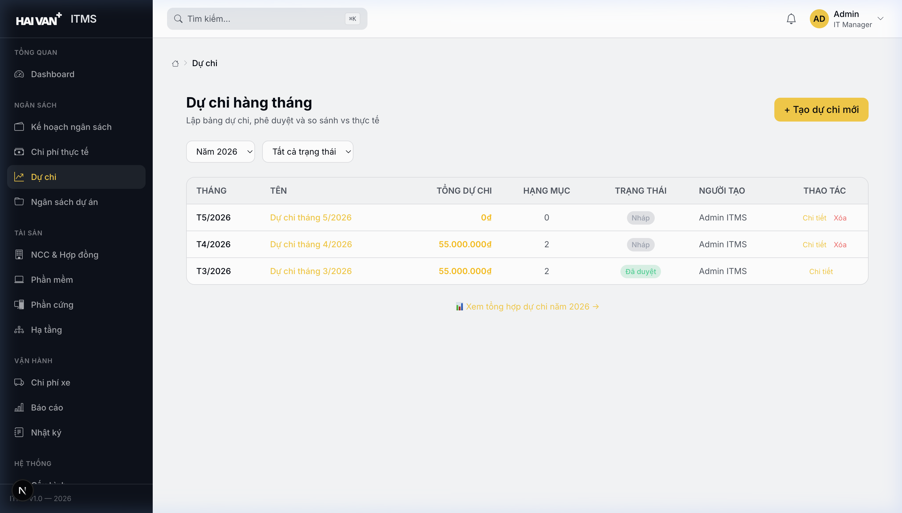

### 6.1 Danh sách Dự báo

| # | Thành phần | Mô tả |
|---|-----------|-------|
| 1 | **Tab "Dự báo theo tháng"** | Xem/tạo dự báo từng tháng |
| 2 | **Tab "Tổng hợp năm"** | Xem dự báo tổng hợp cả năm |
| 3 | **Nút "Tạo dự báo"** | Tạo forecast mới |
| 4 | **Bảng dự báo** | Tháng, Tên dự báo, Tổng tiền, Trạng thái |

### 6.2 Tạo Dự báo

**Các bước**:
1. Nhấn **"Tạo dự báo"**
2. Chọn **Tháng/Năm**
3. Nhập **Tên dự báo**: VD "Dự báo chi phí tháng 4/2026"
4. Thêm các **mục chi phí dự kiến**:
   - Tên hạng mục, Dự án, Số tiền dự kiến, Ghi chú
5. Nhấn **"Lưu nháp"** hoặc **"Gửi duyệt"**

### 6.3 Xem Tổng hợp Năm

**Đường dẫn**: `/forecasts/yearly`

- Bảng tổng hợp 12 tháng: dự báo, thực chi, chênh lệch
- Biểu đồ so sánh dự báo vs thực chi theo tháng

---

## 7. Quản lý Dự án

### Đường dẫn: `/projects`

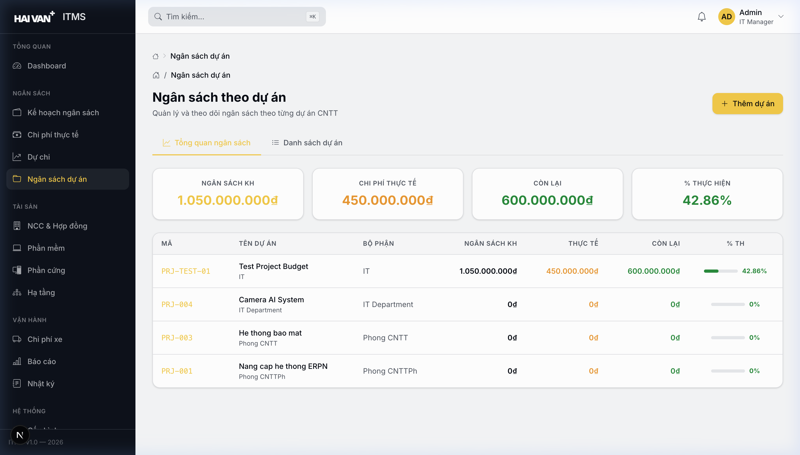

### 7.1 Danh sách Dự án

| # | Thành phần | Mô tả |
|---|-----------|-------|
| 1 | **Thẻ tổng quan** | Tổng ngân sách dự án, đã chi, số dự án |
| 2 | **Nút "Tạo dự án"** | Mở drawer tạo dự án mới |
| 3 | **Danh sách dự án** | Mã, Tên, Ngân sách, Thực chi, % hoàn thành |

### 7.2 Tạo Dự án Mới

**Các bước**:
1. Nhấn **"Tạo dự án"**
2. Drawer mở từ bên phải, nhập:
   - **Mã dự án**: VD "PRJ-ERP-2026"
   - **Tên dự án**
   - **Mô tả**
   - **Ngày bắt đầu** — **Ngày kết thúc**
   - **Phòng ban**
   - **Ghi chú**
3. Nhấn **"Tạo"**

### 7.3 Chi tiết Dự án

**Đường dẫn**: `/projects/[id]`

- **Tổng quan**: Mã, tên, trạng thái, ngày bắt đầu/kết thúc
- **Danh mục ngân sách**: Các hạng mục chi phí liên kết dự án
- **Chi phí thực tế**: Danh sách chi phí ghi nhận
- **Biểu đồ tiến trình**: Ngân sách vs Thực chi

---

## 8. Quản lý NCC & Hợp đồng

### 8.1 Nhà cung cấp (Đường dẫn: `/vendors`)

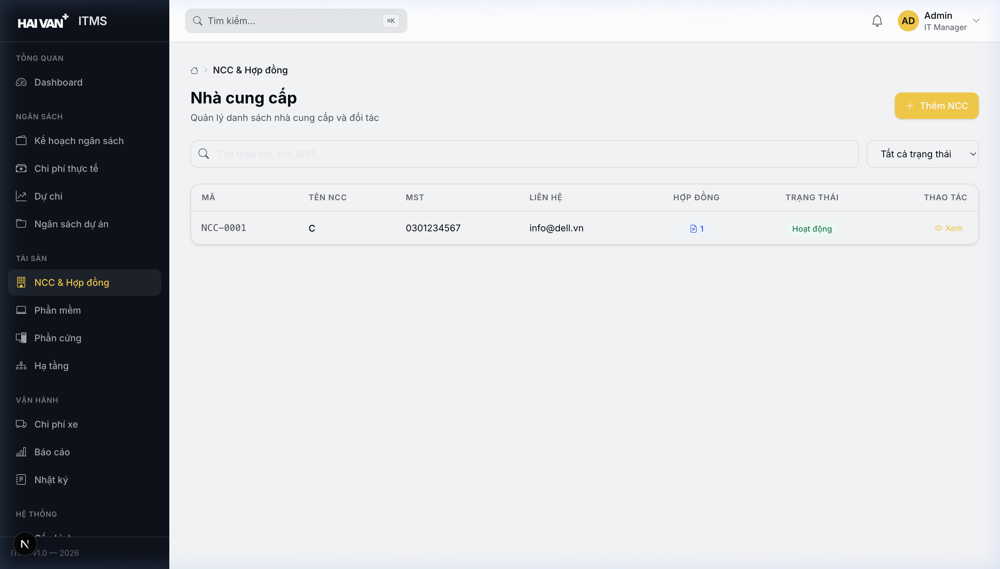

| # | Thao tác | Hướng dẫn |
|---|---------|-----------|
| 1 | **Thêm NCC** | Nhấn "Thêm NCC" → Nhập tên, MST, địa chỉ, SĐT, email, người liên hệ |
| 2 | **Tìm kiếm** | Nhập tên/MST vào ô tìm kiếm |
| 3 | **Xem chi tiết** | Nhấn vào tên NCC → Trang chi tiết (thông tin, hợp đồng, lịch sử) |
| 4 | **Sửa NCC** | Trong trang chi tiết, nhấn "Sửa" |

### 8.2 Hợp đồng (Đường dẫn: `/contracts/create`)

**Các bước tạo Hợp đồng**:
1. Vào trang chi tiết NCC → Tab "Hợp đồng"
2. Nhấn **"Thêm hợp đồng"**
3. Nhập: Số hợp đồng, Tên, Loại, Giá trị, Ngày ký, Ngày hết hạn
4. Đính kèm file (nếu có)
5. Nhấn **"Lưu"**

---

## 9. Quản lý Tài sản Phần mềm

### Đường dẫn: `/inventory/soft`

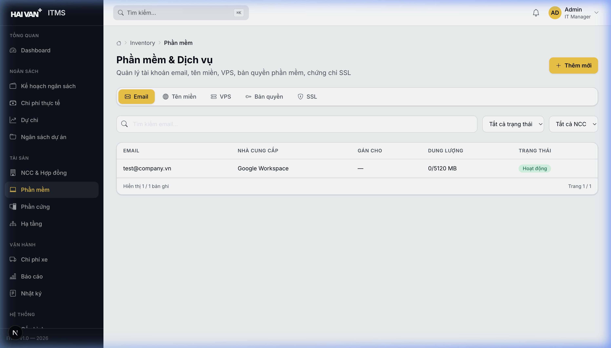

### Cấu trúc Tab

| Tab | Nội dung | Thông tin quản lý |
|-----|----------|-------------------|
| **Email** | Tài khoản email tổ chức | Địa chỉ, nhà cung cấp (Google/Microsoft), trạng thái |
| **Tên miền** | Domain names | Tên miền, registrar, ngày hết hạn, DNS |
| **VPS** | Virtual Private Servers | Hostname, IP, specs (CPU/RAM/SSD), provider |
| **Bản quyền** | Software licenses | Tên PM, loại license, số lượng, ngày hết hạn |
| **SSL** | SSL certificates | Domain, loại cert, ngày hết hạn, provider |

### Thao tác chung cho mỗi tab

1. **Thêm mới**: Nhấn **"Thêm mới"** → Nhập thông tin theo loại
2. **Tìm kiếm**: Nhập tên/domain/IP vào ô tìm kiếm
3. **Lọc trạng thái**: Chọn Active/Expired/Pending
4. **Xem chi tiết**: Nhấn vào dòng trong bảng
5. **Sửa/Xóa**: Nhấn icon hành động ở cột cuối

> ⚠️ **Cảnh báo hết hạn**: Hệ thống tự động đánh dấu các mục sắp hết hạn trong 30 ngày bằng badge màu vàng.

---

## 10. Quản lý Tài sản Phần cứng & Hạ tầng

### Đường dẫn: `/inventory/hard`

### Cấu trúc Tab

| Tab | Nội dung | Thông tin quản lý |
|-----|----------|-------------------|
| **Phần cứng** | Thiết bị vật lý | Mã tài sản, tên, loại, serial, vị trí, người dùng, bảo hành |
| **Hạ tầng** | Network devices | Tên, loại, brand, rack/U, IP, trạng thái |
| **Địa chỉ IP** | IP management | IP, VLAN, loại (Static/Dynamic), trạng thái, ghi chú |

### Thao tác Tab Phần cứng

1. **Thêm thiết bị**: Nhấn **"Thêm mới"**
   - Nhập: Mã tài sản (auto), Tên thiết bị, Loại (laptop/server/printer...)
   - Thông tin bổ sung: Brand, Model, Serial, Specs
   - Quản lý: Vị trí, Người sử dụng, Ngày mua, Bảo hành
2. **Gán cho nhân viên**: Sửa thiết bị → Cập nhật trường "Người sử dụng"
3. **Tìm kiếm**: Theo mã, tên, serial, người dùng

### Trạng thái Phần cứng

| Trạng thái | Ý nghĩa |
|-----------|---------|
| 🟢 **Sẵn sàng** | Chưa gán, có thể cấp phát |
| 🔵 **Đang sử dụng** | Đã gán cho nhân viên |
| 🟡 **Bảo trì** | Đang sửa chữa |
| 🔴 **Hỏng** | Không sử dụng được |
| ⚫ **Thanh lý** | Đã loại bỏ |

---

## 11. Quản lý Phương tiện

### Đường dẫn: `/vehicles`

### Cấu trúc Tab

| Tab | Nội dung |
|-----|----------|
| **Phương tiện** | Danh sách xe: biển số, loại xe, trạng thái, người sử dụng |
| **Dịch vụ** | Lịch bảo dưỡng, sửa chữa định kỳ |
| **Chi phí biến đổi** | Xăng dầu, phí cầu đường, phí phạt... |

### Thao tác

1. **Thêm xe**: Nhấn **"Thêm mới"** → Nhập biển số, loại xe, brand, model
2. **Ghi nhận chi phí xe**: Tab "Chi phí biến đổi" → "Thêm chi phí"
   - Chọn xe, loại chi phí (xăng/bảo trì/sửa chữa)
   - Nhập ngày, số tiền, mô tả
3. **Xem chi tiết xe**: Nhấn vào biển số → Trang chi tiết (lịch sử bảo dưỡng, chi phí)

---

## 12. Báo cáo Tổng hợp

### Đường dẫn: `/reports`

### Các loại Báo cáo

| Tab | Nội dung | Dữ liệu |
|-----|----------|----------|
| **Tổng hợp Ngân sách** | Budget Summary | Tổng NS, thực chi, chênh lệch, % sử dụng theo năm |
| **So sánh Chi phí** | Cost Comparison | Biểu đồ dự chi vs thực chi theo tháng |
| **Tổng quan Tài sản** | Asset Overview | Số lượng tài sản theo loại (HW, SW, Infra) |
| **NS Dự án** | Project Budget | Chi tiết ngân sách từng dự án |

### Thao tác

1. **Chọn năm**: Dropdown chọn năm báo cáo
2. **Chuyển tab**: Nhấn các tab để xem loại báo cáo khác nhau
3. **Xem biểu đồ**: Hover để xem chi tiết số liệu
4. **Xuất báo cáo**: (Tính năng dự kiến) Xuất PDF/Excel

---

## 13. Nhật ký Hoạt động

### Đường dẫn: `/activity-log`

### Các thành phần

| # | Thành phần | Mô tả |
|---|-----------|-------|
| 1 | **Thẻ Tổng số** | Tổng số log ghi nhận |
| 2 | **Thẻ Module phổ biến** | Module có nhiều log nhất |
| 3 | **Thẻ Hành động phổ biến** | Loại thao tác phổ biến nhất (CREATE/UPDATE/DELETE) |
| 4 | **Thẻ User gần nhất** | Người dùng thao tác gần nhất |
| 5 | **Bảng nhật ký** | Thời gian, User, Module, Hành động, Đối tượng, IP |

### Thao tác

1. **Lọc theo Module**: Chọn module (budget-plans, costs, users...)
2. **Lọc theo Hành động**: CREATE, UPDATE, DELETE
3. **Lọc theo Ngày**: Chọn khoảng thời gian
4. **Tìm kiếm**: Theo tên user hoặc đối tượng
5. **Tab "Lịch sử tôi"**: Xem chỉ các thao tác của bản thân

---

## 14. Quản trị Hệ thống

### 14.1 Quản lý Người dùng

**Đường dẫn**: `/settings/users`

### Thao tác

| # | Thao tác | Hướng dẫn |
|---|---------|-----------|
| 1 | **Thêm người dùng** | Nhấn "Thêm người dùng" → Nhập email, họ tên, vai trò, phòng ban |
| 2 | **Sửa thông tin** | Nhấn icon bút chì → Cập nhật thông tin |
| 3 | **Vô hiệu hóa** | Nhấn icon khóa → Tài khoản sẽ không đăng nhập được |
| 4 | **Phân quyền** | Chọn vai trò: Admin, Manager, User, Viewer |

### Ma trận Phân quyền

| Module | Admin | Manager | User | Viewer |
|--------|-------|---------|------|--------|
| Dashboard | ✅ Xem | ✅ Xem | ✅ Xem | ✅ Xem |
| Kế hoạch NS | ✅ CRUD + Duyệt | ✅ CRUD + Duyệt | ✅ Xem | ✅ Xem |
| Chi phí | ✅ CRUD | ✅ CRUD | ✅ Tạo/Xem | ✅ Xem |
| Dự án | ✅ CRUD | ✅ CRUD | ✅ Xem | ✅ Xem |
| Tài sản | ✅ CRUD | ✅ CRUD | ✅ Xem/Sửa (assigned) | ✅ Xem |
| Người dùng | ✅ CRUD | ❌ | ❌ | ❌ |
| Nhật ký | ✅ Xem tất cả | ✅ Xem tất cả | ✅ Chỉ của mình | ❌ |

---

## 15. Flows & Use Cases

### 🔄 Flow 1: Quy trình Lập & Duyệt Kế hoạch Ngân sách

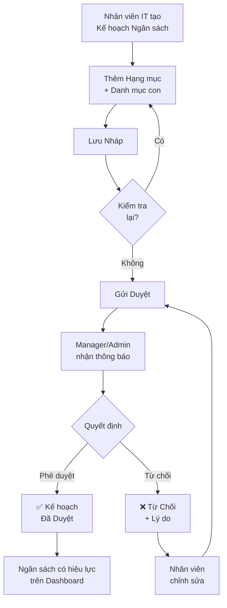

**Hướng dẫn từng bước**:

| Bước | Người | Hành động | Màn hình |
|------|-------|-----------|----------|
| 1 | User/Manager | Vào `/budget/plans` → "Tạo kế hoạch" | Trang tạo KH |
| 2 | User/Manager | Nhập tên, năm, quý, mô tả | Form tạo KH |
| 3 | User/Manager | Thêm hạng mục (VD: Phần cứng, Phần mềm) | Form tạo KH |
| 4 | User/Manager | Thêm danh mục con + đơn giá × số lượng | Form tạo KH |
| 5 | User/Manager | Nhấn "Lưu nháp" hoặc "Gửi duyệt" | Form tạo KH |
| 6 | Admin/Manager | Vào `/budget/plans` → filter "Chờ duyệt" | Danh sách KH |
| 7 | Admin/Manager | Nhấn vào KH → Xem chi tiết → "Phê duyệt" | Chi tiết KH |
| 8 | Hệ thống | Cập nhật Dashboard, thông báo cho người tạo | Dashboard |

---

### 🔄 Flow 2: Quy trình Ghi nhận Chi phí

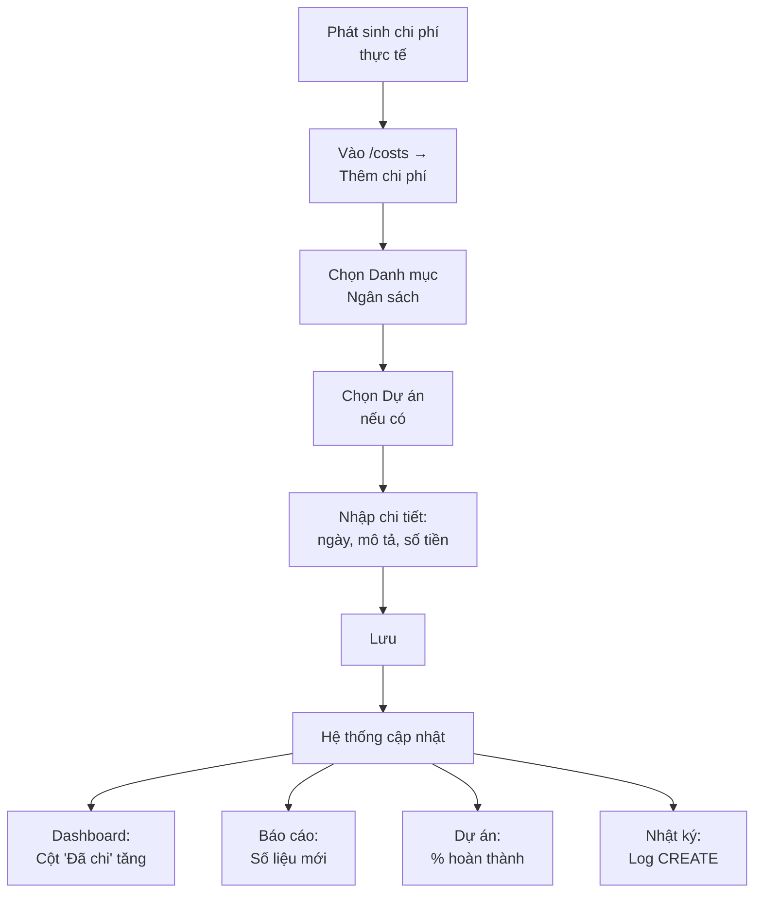

**Hướng dẫn từng bước**:

| Bước | Hành động | Chi tiết |
|------|-----------|----------|
| 1 | Vào `/costs` | Trang danh sách chi phí |
| 2 | Nhấn "Thêm chi phí" | Mở form tạo mới |
| 3 | Chọn Budget Item | Liên kết với kế hoạch ngân sách đã duyệt |
| 4 | Chọn dự án (tùy chọn) | Gán chi phí cho dự án cụ thể |
| 5 | Nhập ngày, danh mục, mô tả, số tiền | Thông tin chi phí |
| 6 | Nhấn "Lưu" | Chi phí được ghi nhận |
| 7 | Kiểm tra Dashboard | Số liệu đã cập nhật |

---

### 🔄 Flow 3: Quy trình Quản lý Tài sản IT (cấp phát thiết bị)

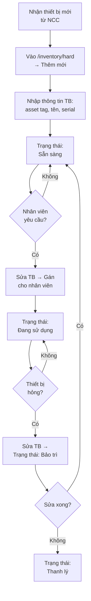

**Hướng dẫn từng bước**:

| Bước | Hành động | Màn hình |
|------|-----------|----------|
| 1 | Nhận thiết bị, vào `/inventory/hard` | Tab Phần cứng |
| 2 | Nhấn "Thêm mới" → Nhập thông tin | Form thêm phần cứng |
| 3 | Thiết bị có trạng thái "Sẵn sàng" | Danh sách phần cứng |
| 4 | Khi cấp phát: Sửa → Cập nhật "Người sử dụng" | Form sửa phần cứng |
| 5 | Trạng thái tự chuyển "Đang sử dụng" | Danh sách phần cứng |
| 6 | Khi hỏng: Sửa → Chuyển trạng thái "Bảo trì" | Form sửa phần cứng |

---

### 🔄 Flow 4: Quy trình Quản lý NCC → Hợp đồng → Chi phí

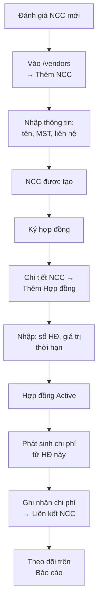

**Hướng dẫn từng bước**:

| Bước | Hành động | Màn hình |
|------|-----------|----------|
| 1 | Vào `/vendors` → "Thêm NCC" | Trang tạo NCC |
| 2 | Nhập đầy đủ thông tin | Form tạo NCC |
| 3 | Vào chi tiết NCC → Tab "Hợp đồng" | Chi tiết NCC |
| 4 | "Thêm hợp đồng" → Nhập thông tin | Form tạo HĐ |
| 5 | Khi có chi phí: `/costs/create` → Chọn NCC | Tạo chi phí |

---

### 🔄 Flow 5: Quy trình Dự báo và So sánh Chi phí

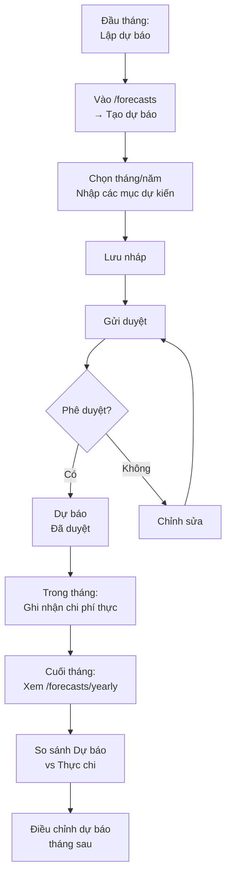

---

### 🔄 Flow 6: Quy trình Setup Dự án IT (End-to-End)

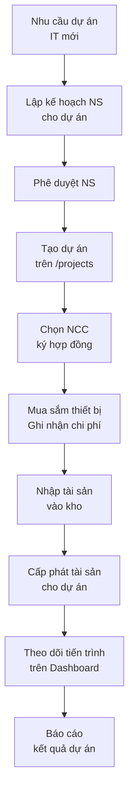

**Hướng dẫn tổng hợp**:

| Giai đoạn | Hành động | Module liên quan |
|-----------|-----------|-----------------|
| **Lập kế hoạch** | Tạo Budget Plan với hạng mục cho dự án | Kế hoạch NS |
| **Phê duyệt** | Manager/Admin duyệt kế hoạch | Kế hoạch NS |
| **Tạo dự án** | Tạo project với mã, ngân sách, timeline | Quản lý Dự án |
| **Ký hợp đồng** | Thêm NCC, tạo hợp đồng | NCC & Hợp đồng |
| **Thực hiện** | Ghi nhận chi phí, nhập tài sản, cấp phát | Chi phí, Tài sản |
| **Giám sát** | Kiểm tra Dashboard và Báo cáo | Dashboard, Báo cáo |

---

### 🔄 Flow 7: Quy trình Kiểm kê Tài sản Định kỳ

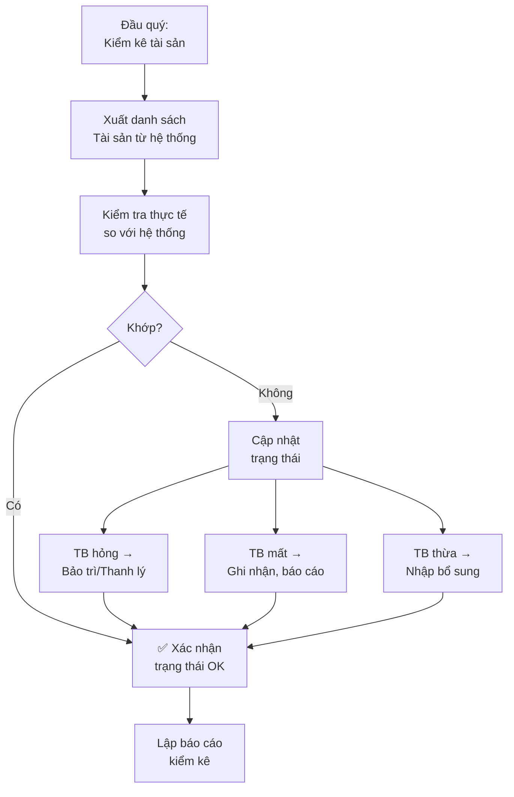

---

### 🔄 Flow 8: Quy trình Quản lý Chi phí Xe

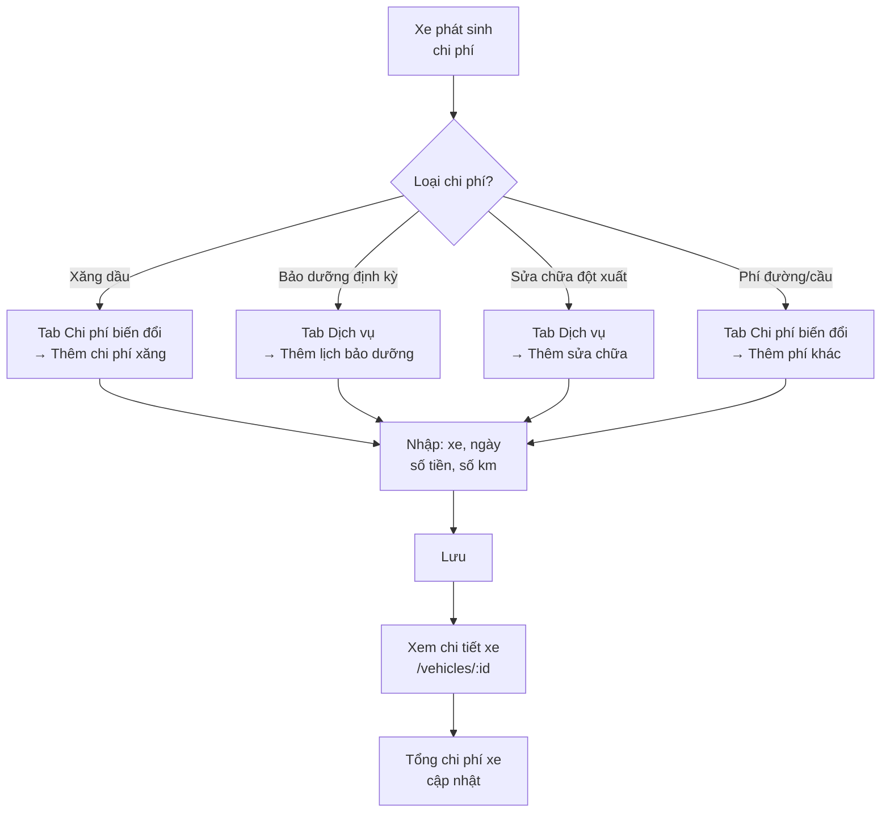

---

## Phụ lục

### Phím tắt

| Phím | Chức năng |
|------|-----------|
| `Esc` | Đóng dialog/modal/drawer đang mở |
| `Enter` | Xác nhận form đang điền |

### Định dạng Số tiền

- Đơn vị: **VNĐ** (Việt Nam Đồng)
- Format: `1.500.000.000` (dấu chấm phân cách hàng nghìn)
- Viết tắt trên Dashboard: `1.5B` = 1.500.000.000, `525M` = 525.000.000

### Hỗ trợ Kỹ thuật

| Kênh | Thông tin |
|------|-----------|
| **Email** | it@haivan.com |
| **Hotline** | 0236-xxx-xxxx |
| **API Docs** | `/api/docs` (Swagger) |
| **Health Check** | `/api/v1/health` |

---

> 📝 **Tài liệu này được cập nhật lần cuối**: 14/03/2026  
> **Phiên bản**: 1.0.0
